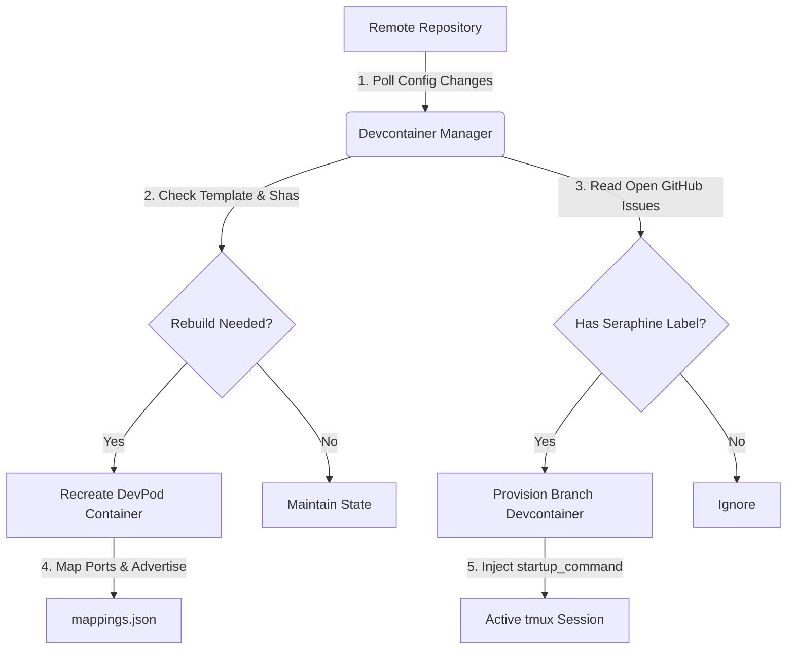

# Devcontainer Manager

**Devcontainer Manager (DCM)** is a daemon written in Go designed to automatically manage, run, and sync [DevPod](https://devpod.sh/) devcontainers on a Linux environment. It continuously monitors remote Git repository templates and coordinates the lifecycle of active workspaces, handling configurations, port mapping, and GitHub-integrated issue environments.

---

## 🚀 Key Capabilities

*   **Continuous Synchronization:** Detects configuration changes in remote templates and aligns local devcontainers by rebuilding or cleaning them up.
*   **Startup Failure Recovery:** Automatically deletes devcontainers if they fail to start properly, allowing them to be cleanly re-provisioned from head on the next cycle.
*   **Fresh Issue Containers:** Forces devpod to recreate issue containers to always pull the freshest container config from head, bypassing the local cache.
*   **GitHub Issue Devcontainers:** Automatically provisions dedicated devcontainers for open issues containing `seraphine` labels, querying both issue metadata and bodies to deduplicate container reports, and handling state labels (`container-creating`, `container-ready`, `container-failed`) dynamically.
*   **Container Prioritization:** Dynamically orders container startup operations, prioritizing repositories that have been most recently updated (pushed) on GitHub.
*   **Deterministic Caching:** Minimizes rebuild times by storing composite SHAs of configurations and script dependencies in a state cache.
*   **Deterministic Branch Slugs:** Generates consistent, 3-word branch names from issue titles locally without relying on external APIs, preventing provisioning failures caused by network timeouts or empty LLM outputs.
*   **Automatic SSH Mapping:** Assigns unique SSH ports to workspaces, facilitating reverse-proxy routing via systems like `dcrouter`.
*   **Startup Command Injection:** Polls containers via SSH until they are ready, then automatically injects execution commands into the container's active tmux session.
*   **Robust Command Timeouts:** Prevents standard output pipe leaks from background tasks from deadlocking the issue provisioning loops.
*   **Robust Observability & Prefixed Logging:** Prepends all log messages and command outputs with a `[owner/repo]` prefix for concurrent readability. Reports startup failure logs back to GitHub issues, automatically falling back to the `devcontainer-manager` repository if permission errors (e.g. 403 or 404) are encountered.
*   **GitHub API Rate Limit Retries:** Wraps GitHub API calls in a retry handler that performs exponential backoff when encountering rate limit responses (HTTP 403 or 429).
*   **Latency Metric Tracking:** Automatically calculates and logs startup latency metrics for GitHub issues by recording `devcontainer-startup-latency` to GitHub comments after successful container provisioning. Includes robust test cases to verify error handling and prevent duplicate postings.
*   **Manual Container Provisioning:** Processes manually-triggered container start requests (transitioning them from `DCM_RECEIVED` to `DCM_CREATING` and then to `DCM_READY`) via the gRPC interface asynchronously, handling provisioning failures gracefully. Injects prompt startup commands into `--prompt-interactive agy` session if supplied in `UpRequest` or defaults to issue/repo startup commands. Adjusts issue labels to `container-creating`, `container-ready`, or `container-failed` as appropriate for issue-linked manual containers. Sanitizes container IDs to conform to Devpod's workspace naming conventions (lowercase letters, numbers, and dashes), extracts valid repository clone URLs from issue links, and files detailed startup failure issues automatically on failure.
*   **Startup Failure Deduplication:** Avoids filing duplicate GitHub issues for container startup failures using a helper function that checks for pre-existing open issues with the title `Issue Container Startup Failed`. If writing to the fallback repository (`devcontainer-manager`), it checks for the specific target repository reference in the issue body. Enforces a 65,000 character limit on the log content, truncating and prepending a truncation message if exceeded.
---

## 🛠️ Architecture & Workflow



---

## 📋 Prerequisites

Before running the Devcontainer Manager, ensure that the following dependencies are installed and available in the daemon host's environment:

*   **Go** (v1.20+)
*   **Docker** / **Podman** (underlying container provider)
*   **DevPod CLI** (`devpod` or `devpod-cli` installed in your path)
*   **GitHub CLI** (`gh`, authenticated to list issues, write pull requests, and manage issue labels)
*   **tmux** (installed inside target devcontainers to support startup command injections)

---

## ⚙️ Installation & Setup

### 1. Automatic systemd User Service Setup (Recommended)
Use the included automated install script to build, configure, and register the manager as a persistent systemd user service.

```bash
./install.sh
```

> [!NOTE]
> The `install.sh` script does not require root privileges for standard setups. Running it executes the following steps:
> 1. Compiles the binary using the local Go environment.
> 2. Places the compiled binary under `~/.local/bin/devcontainer-manager`.
> 3. Creates a systemd unit file at `~/.config/systemd/user/devcontainer-manager.service`.
> 4. Configures lingering (`loginctl enable-linger`) so that the daemon runs in the background even when you are not logged in.
> 5. Reloads systemd and enables the service to start automatically on system boot.

To verify that the service is running successfully:
```bash
systemctl --user status devcontainer-manager
```

### 2. Manual Startup
For manual runs or local debugging, you can build and run the binary directly:

```bash
go build -o devcontainer-manager main.go
./devcontainer-manager -container_list container.list.template
```

---

If no custom startup command is supplied via the flag, issue-specific containers will default to injecting a prompt that dynamically references the GitHub issue/bug number they were created for.

## ⌨️ Command-Line Interface (CLI)

The manager supports configuration via the following command-line flags:

| Flag | Type | Default | Description |
| :--- | :--- | :--- | :--- |
| `-once` | `bool` | `false` | Runs the synchronization check once and exits immediately instead of polling in a loop. |
| `-container_list` | `string` | `container.list.template` | The template file specifying the target Git repositories to track and manage. |
| `-max_issue_containers`| `int` | `5` | The maximum number of concurrent issue-based devcontainers allowed to run simultaneously. |
| `-startup_command` | `string` | `""` | A shell command to inject dynamically into the container's primary tmux session once it is active. |
| `-max-concurrency` | `int` | `10` | The maximum number of concurrent repository processing threads/goroutines. |
| `-port` | `int` | `50051` | The port to run the gRPC dashboard service on. |

---

## 💾 Caching & State Persistence

DCM keeps track of the active configurations it processes to prevent redundant rebuilds:
*   **Location:** Caches are persisted at `~/.config/devcontainer-manager/tracked_shas.json`.
*   **Behavior:** Stores deterministic composite hashes of tracking files (`devcontainer.json`, `postCreateCommand`, etc.).
*   **Manual Override:** If you need to force a complete rebuild of all managed containers, delete the state file:
    ```bash
    rm ~/.config/devcontainer-manager/tracked_shas.json
    ```

## 📊 gRPC Manager Service (Previously Dashboard)

DCM hosts a gRPC service implementing `ManagerService` defined in `proto/manager.proto` (which replaces and deprecates `dashboard.proto`). This service provides:
*   **Up RPC:** Programmatically trigger the creation of a devcontainer for a specific repository, branch, or issue (with explicit harness selection via `Harness` enum: `HARNESS_UNSPECIFIED`, `HARNESS_ANTIGRAVITY`, `HARNESS_PI`). Automatically checks if the specified branch exists on the target repository and creates it off `main` (or default branch) if missing.
*   **Down RPC:** Terminates and cleans up an existing devcontainer instance/config from the cache by ID.
*   **List RPC:** Retrieves a list of active devcontainers with their metadata, including ID, Request details, current State (`DCM_RECEIVED`, `DCM_READY`, `DCM_FAILED`, etc.), and retry status.
*   **PushPrompt RPC:** Dispatches prompt payloads to target containers in the in-memory cache. Validates container existence (`NotFound` error if missing) and verifies container state is `DCM_READY` (`FailedPrecondition` error if not). Verifies that the tmux session is active (with fallback to the base ID if the session was created without the issue number suffix), and uses `devpod ssh` with `tmux send-keys` to inject the prompt. Retains containers in `DCM_READY` state after prompt execution to allow subsequent prompt calls.
*   **Internal Cache:** The internal server cache now maps containers directly to `DevcontainerConfig`, completely deprecating the old `Container` type and `ListContainers` RPC.
*   **Thread-Safe State persistence:** The state is updated in real-time as devcontainers transition through different lifecycle stages, and integrates with persistent storage (`pstore`).
*   **Identifier Tracking:** Devcontainers associated with specific issues correctly populate their `Identifier` context in the cache, and existing test suites enforce correct schema implementations via the gRPC client layer.

---

## 🔎 Integration Prober CLI

DCM includes a standalone integration prober tool under `cmd/prober/main.go` that validates the end-to-end lifecycle of devcontainer workspaces managed by `devcontainer-manager`.

### Capabilities:
* **GitHub Issue Lifecycle:** Creates a temporary test issue (`[test] <uuid>`) in the target repository.
* **Provisioning Validation:** Submits an `Up` RPC request to the manager using the issue URL.
* **Prompt Loop Verification:** Polls the issue comments until the container posts the first prompt response (`hello`), then calls `PushPrompt` with the second prompt (`goodbye`) and verifies its response.
* **Destruction & Cleanup:** Calls the `Down` RPC, verifies the container is deleted from the `List` RPC, closes the test GitHub issue, and cleans up resources even in case of timeouts or failure.
* **Failure Diagnostics:** Outputs all currently running devcontainers if the comment polling times out or fails, enabling easier debugging of provisioning issues.

### Running the Prober:
```bash
go run cmd/prober/main.go --server localhost:50051 --repo brotherlogic/devcontainer-manager --prompt-1 hello --prompt-2 goodbye --timeout 5m
```

---

## 🤖 Automated GitHub Workflows

The repository includes pre-configured automation workflows under `.github/workflows/`:
*   **Issue Closer Workflow (`issue-closer.yml`):** Runs every 5 minutes to automatically query GitHub's Sub-issues API, closing parent issues once all related child sub-issues are marked closed.
*   **Assign Reviewer Workflow (`assign-reviewer.yml`):** Automatically assigns the repository owner (`brotherlogic`) as a reviewer on new pull requests once validation checks pass.

---

## 🔗 Project Workflows & Contributions
For details on the issue lifecycle, label transitions, and the AI-driven development workflows utilized in this project, refer to the [Issues Workflow Guide (issues.md)](file:///workspaces/devcontainer-manager/issues.md).

## 🧪 Testing
Run the unit test suite using the standard Go test command:
```bash
go test -v ./...
```
The test suite includes extensive mocking of GitHub API responses to verify:
* Successful issue creation on target repositories.
* Fallback write paths when lacking write permissions on target repositories.
* Deduplication of startup failure issues.
* Text truncation for log files exceeding GitHub's body length limits.
